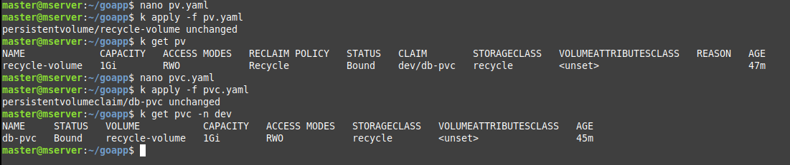

# Kuberneted Final Assignment

As a DevOps Engineer, You are being assigned a task for designing and building Kubernetes infra and resources. You should be using all possible best ways to make it reliable, secure and resilient setup.

1. You need to have a cluster ready with atleast one maste and a worker node. Do you have?
2.  As a Kubernetes expert, you need to setup a prod and a dev setup
3. Dev has 2 Deployments, web-test and app with a DB pod of mongo.
4. In dev, both deployments are locally available and db is only talk with app
5. Database : Volume is being used for db of recycle one. 
6. For Website, Use a simple webpage of your choice with env variable used (hint : comfigmap and secrets).
7. Replicate same setup for Production setup but it should be resilliant and follow best practices 
8. Suggest some optimization steps.

---

### Brain Storming:   

Above is the task assigned to me as **Devops** Engineer. Let's analyze it and then solve it efficiently.    
- 1st we need to setup a K8s Cluster, but i have alreday created the cluster with 1 master & 1 worker node using **Kubeadm** which you can see [here](https://github.com/Tariq-Mehmood-Malik/Kubernetes-Cluster-Creation/blob/main/README.md).
- Now lets focus to next steps, we need to create 2 different namespaces (Virtual Clusters) named **dev** & **prod**.
- Our cluster should have 2 Deployments named **web-test** and **app** along with a `Pod` of **mongo** database.
- Should be locally availabe means we need to create service for each deployemnt with type **`NodePort`**.
- To ensure that DB pod is only talk with app deploymentand we need to create Network Policy.  
- Our DB pod should use Volume for its data storage with recycle policy.
- Our web-test deployment should use simple webpage with **env** variable, we will use ConfigMap for index.html as volume and attached it to our web container.
- After that we have to recreate at same setup for **prod** in this step we use multiple K8s features & resources and also follows best practices to make our cluster more optimized and resilliant.

---

# My-Solution:

## Dev Cluster

## App Deployment

This is dev setup only for testing creating baseline for production, in production enviroment (namespace) i will enhance each resource to my knowledge.   

### 1. Creating Namespace   

Lets 1st create a namespace called **dev** for deveploment enviroment for building and testing our cluster.   

  ```bash
  mkdri goapp
  cd goapp/
  kubectl create namespace dev
  k get ns
  ```   


### 2. Creating Mongo-DB Pod along PV, PVC & SVC    

##### pv.yaml
```yaml
apiVersion: v1
kind: PersistentVolume
metadata:
  name: recycle-volume
spec:
  capacity:
    storage: 1Gi
  accessModes:
    - ReadWriteOnce
  persistentVolumeReclaimPolicy: Recycle
  storageClassName: recycle
  hostPath:
    path: /tmp/pv
```

##### pvc.yaml

```yaml
apiVersion: v1
kind: PersistentVolumeClaim
metadata:
  name: db-pvc
  namespace: dev
spec:
  accessModes:
    - ReadWriteOnce
  resources:
    requests:
      storage: 500Mi  
  storageClassName: recycle
```

```bash
nano pv.yaml
nano pvc.yaml
k apply -f pv.yaml
k apply -f pvc.yaml
k get pv
k get pvc -n dev
```





<!-- This is hidden text

Lets create secret for Mongo DB credentials.


##### db-secret.yaml
```yaml
apiVersion: v1
kind: Secret
metadata:
  name: mongo-credentials
  namespace: dev
type: Opaque
data:
  MONGO_INITDB_ROOT_USERNAME: cm9vdA==  # base64 encoded value of "root"
  MONGO_INITDB_ROOT_PASSWORD: cm9vdHBhc3M=  # base64 encoded value of "rootpass"
  MONGO_INITDB_DATABASE: bXlhcHBkYg==  # base64 encoded value of "myappdb"
```

```bash
nano db-secret.yaml
k apply -f db-secret.yaml
k get secret -n dev
```


 -->

Now creating DB POD of mongo. (In prod section we will use StatefulSet for DB pod).

##### mongo.yaml
```yaml
apiVersion: v1
kind: Pod
metadata:
  name: mongo
  namespace: dev
  labels:
    app: mongo
spec:
  containers:
    - name: mongo
      image: mongo
      ports:
        - containerPort: 27017
      volumeMounts:
        - mountPath: /data/db
          name: db-data
  volumes:
    - name: db-data
      persistentVolumeClaim:
        claimName: db-pvc
```

```bash
nano mongo.yaml
k apply -f mongo.yaml
k get po -n dev
```


Now lets create a service for our Database through which the our app deployment pods can communicate with DB pod.

##### mongo-svc.yaml   
```yaml
apiVersion: v1
kind: Service
metadata:
  name: db-svc
  namespace: dev
spec:
  ports:
    - targetPort: 27017
      port: 27017
  selector:
    app: mongo
  type: ClusterIP
```

```bash
nano mongo-svc.yaml
k apply -f mongo-svc.yaml 
k get svc -n dev
k get po -o wide -n dev
```


### 2. Creating App Deployment    

I have using this [git-repo](https://github.com/wahyueko22/golang-app/tree/master/go-mongo) for app source code, i have modified souce code **Dockerfile** into multistage to reduce image size.

```bash
git clone https://github.com/wahyueko22/golang-app.git
cd golang-app/
ls
cd go-mongo/
ls
nano Dockerfile
docker build -t tariqmehmoodmalik/go-mongo:1.1 .
docker push tariqmehmoodmalik/go-mongo:1.1
```

```yaml
FROM golang:1.16.3 AS builder

LABEL maintainer="tariqmalik323@gmail.com"

WORKDIR /app
COPY . .

RUN CGO_ENABLED=0 GOOS=linux go build \
    -ldflags="-w -s" \
    -o main .

FROM scratch

WORKDIR /app
COPY --from=builder /app/main .

COPY --from=builder /etc/ssl/certs/ca-certificates.crt /etc/ssl/certs/

EXPOSE 8009

CMD ["./main"]
```


Now lets create **app** deployment.

##### app-dep.yaml   
```yaml
apiVersion: apps/v1
kind: Deployment
metadata:
  name: goapp
  namespace: dev
  labels:
    app: goapp
spec:
  replicas: 1
  selector:
    matchLabels:
      app: goapp
  template:
    metadata:
      labels:
        app: goapp
    spec:
      containers:
        - name: goapp
          image: tariqmehmoodmalik/go-mongo:1.1
          ports:
            - containerPort: 8009
          imagePullPolicy: Always
```

```bash
nano app-dep.yaml 
k apply -f app-dep.yaml 
k get po -n dev
k get po -o wide -n dev
```


Now lets create a service type **NodePort** for our deployment app.

##### app-svc.yaml   
```yaml
apiVersion: v1
kind: Service
metadata:
  name: service-app
  namespace: dev
spec:
  type: NodePort
  ports:
    - targetPort: 8009
      port: 8009
      nodePort: 30080
  selector:
    app: goapp
```
```bash
nano app-svc.yaml
k apply -f app-svc.yaml 
k get svc -n dev
```


Lets test out **goapp** in through web.   


   


Lets test our app connectivity with databse. First go to mongo pod **CLI** tesrminal and try to access our app through **curl**.   


```bash
k get svc -n dev
k exec -it -n dev pod/mongo -- /bin/sh
curl 10.102.254.204:8009
```

 
   


## Web-App Deployment


### 1. Creating Web-App index.html    


Now its time to create deployment called **web-test** in yaml file named `web-test.yaml` that should use simple webpage with **env** variables.    

Before creating deployment yaml lets create CM that stores our custom index.html file and mount it as ConfigMap Volume.   

##### index-html.yaml      
```yaml
apiVersion: v1
kind: ConfigMap
metadata:
  name: index-html
  namespace: dev
data:
  index.html: |
    <!DOCTYPE html>
    <html>
    <head>
      <title>DevOps-12</title>
    </head>
    <body>
      <h1>Welcome Students</h1>
      <p>This is Tariq Mehmood</p>
    </body>
    </html>
```   


```bash
nano index-html.yaml
k apply -f index-html.yaml 
k get cm -n dev
```


### 2. Creating Web-App Deployment    

Now lets create our web-test deployment using nginx.


##### web-dep.yaml   
```yaml
apiVersion: apps/v1
kind: Deployment
metadata:
  name: web-test
  namespace: dev
  labels:
    app: web-dep
spec:
  replicas: 1
  selector:
    matchLabels:
      app: nginx-webapp
  template:
    metadata:
      labels:
        app: nginx-webapp
    spec:
      containers:
        - name: web-container
          image: nginx
          ports:
            - containerPort: 80
          volumeMounts:
            - name: html-template
              mountPath: /usr/share/nginx/html/index.html
              subPath: index.html
      volumes:
        - name: html-template
          configMap:
            name: index-html
```

Now lets create a service type **NodePort** for our deployment web-test.

##### web-svc.yaml
```yaml
apiVersion: v1
kind: Service
metadata:
  name: service-webapp
  namespace: dev
spec:
  type: NodePort
  ports:
    - targetPort: 80
      port: 80
      nodePort: 30082
  selector:
    app: nginx-webapp
```


Now lets create all objects one by one and test them.

```bash
nano index-html.yaml
k apply -f index-html.yaml 
k get cm -n dev
nano web-dep.yaml 
k apply -f web-dep.yaml 
nano web-svc.yaml 
k apply -f web-svc.yaml 
k get all -n dev
```


---

# Prod

Lets create a Network Policy that allows traffic only from app PODs to DB POD.

##### app-bd-policy.yaml
```yaml
apiVersion: networking.k8s.io/v1
kind: NetworkPolicy
metadata:
  name: app-to-db
  namespace: prod
spec:
  podSelector:
    matchLabels:
      type: mongo-db
  ingress:
    - from:
        - podSelector:
            matchLabels:
              app: python-app
      ports:
        - protocol: TCP
          port: 27017
```


