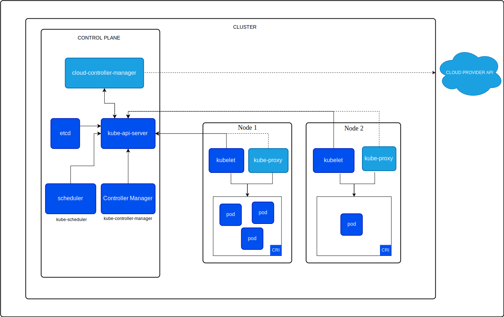

# Kubernetes

## How we got Kubernetes

Imagine you're a developer trying to deploy an app. Docker comes to the rescue by introducing containers, which package your app and all its dependencies into a neat, portable unit that can run anywhere whether on your laptop or in the cloud. This makes it much easier to develop and deploy apps consistently across different environments.

As your app grows, you realize you need more than just one container. You need multiple containers—one for the web server, one for the database, and others for different services. Docker provides Docker Compose, a tool that allows you to define and manage multiple containers as a single application using a simple configuration file. This is a big step forward for handling more complex apps, especially during development and testing.

But soon, the scale of your app increases further, and you need to run containers across multiple machines, or nodes, to meet growing demand. This is where Docker Swarm comes in. Swarm helps you manage a cluster of nodes and introduces the concept of replicas, where you can run multiple copies of a container to handle increased traffic. Swarm also provides built-in load balancing, automatically distributing traffic across the replicas. This ensures that no single container is overloaded and that your app remains available even if some containers fail.

However, as your app grows even larger and becomes more complex, manually managing and scaling containers becomes a significant challenge. That’s when Kubernetes enters the picture. Kubernetes builds on the ideas introduced by Docker and Docker Swarm but offers a much more powerful and flexible system for automating container orchestration. It not only manages containers across many nodes but also provides advanced features like auto-scaling, self-healing, rolling updates, and storage orchestration. These capabilities make Kubernetes the go-to solution for managing large-scale, production-grade applications with complex requirements.

---
## So, What is Kubernetes?

Kubernetes (K8s) is an open-source platform designed to automate deploying, scaling, and operating application containers, ensuring efficient use of resources, high availability, and load balancing. 
It was originally developed by **Google** and is now maintained by the **Cloud Native Computing Foundation (CNCF)**. Kubernetes has become the go to standard for container orchestration, enabling developers to manage containerized applications across a cluster of machines.

- **Scaling:** Containers are automatically scaled based on demand using horizontal scaling.
- **Operation:** Health checks, self-healing, and monitoring ensure containers run smoothly, with automatic restarts or replacements if issues arise.
- **High Availability:** Replica sets and load balancing ensure that applications stay up and responsive, even if containers or nodes fail.
- **Resource Efficiency:** Resource limits and Kubernetes optimizations ensure efficient use of compute resources.

## How Kubernetes Works / Architecture

As we already knows that kubernetes operates in a multi-node infrastructure called `cluster`. A Kubernetes cluster is a set of nodes (physical or virtual machines) that run containerized applications. 

It consists of:
- **Control Plane (Master Node)**
- **Worker Nodes (Data Plane)**
 
### Master Node / Control Plane:    
  The master node is where `control plane` components runs, these components are responsible for managing the cluster to achieve the desired state of applications. 
  To ensure high availability there can be multiple master nodes for the `control plane`.  

### Worker Nodes / Data Plane: 
  These nodes are contorlled by control plane and responsible of running the applications, which includes execution of workloads, process requests, and running containers. The group of worker nodes is called `Data Plane`.

## Core Components

Before diving into details of Master & Worker node components lets first understand what is `Pod`:

- ***Pod:***   
  We already know what is container and how container works. Now the `Pod` in k8s is nothing more than a wrapper or a "bubble" that can hold one or more containers. In Kubernetes Pod is smallest deployable unit , not individual containers.
    
- ***Why Pod:***   
  K8s uses Pods instead of individual containers because they provide a way to group multiple containers that need to work together, if you are running application container and it need an other container for logging or monitoring in k8s single pod can be use for it. All containers in single Pod share the same network, storage, and resources, making it easy for them to communicate and collaborate. Pods also simplify management because all containers in a Pod start, stop, and scale together as a single unit. This ensures that a Pod of tightly coupled containers are treated as one logical application.

### Master Node Components:

- **Kube-API Server**   
  This is main communuication hub in K8s architecture,  It receives commands/instructions from the CLI (via kubectl) and communicates with other components.

- **Scheduler**   
  When the API Server receives instructions for resource creation such as Pods, it forwards them to the Scheduler. The Scheduler places the Pods onto available worker nodes based on resource availability and workload distribution. It decides where new resources should be created, considering factors like CPU, memory, and other constraints.

- **etcd**   
  After the Scheduler places the Pod on a worker node, the API Server sends the details to etcd. etcd is a distributed key-value store that holds all cluster data and the desired state of the system. It stores configurations, metadata, and runtime state, acting as the "source of truth" for the Kubernetes cluster.
  
- **Controller Manager**   
  The Controller Manager continuously monitors the cluster to ensure it is running in the desired state. It uses information from the API Server and etcd to perform tasks such as maintaining the correct number of Pods, handling node failures, and managing the endpoints for Services. The Controller Manager is responsible for maintaining system health and ensuring that the desired state is consistently met.

- **Cloud Controller Manager (Cloud Only)**   
  It is primarily used when Kubernetes is hosted on a cloud provider. It is a component that allows Kubernetes to interact with the underlying cloud provider's API. It manages cloud-specific resources, such as load balancers, volumes, and networking, and ensures that Kubernetes resources (like nodes and services) are correctly integrated with the cloud infrastructure.

### Worker Node Components:
  
- **Kubelet**   
  Its essential components of each worker node it communicates with the Control Plane (Master Node) to receive instructions and report the status of the node. It ensures that desired containers are running in a Pod as expected. It constantly monitors the Pods assigned to its node, ensuring they are healthy and in the desired state. If a container fails or is terminated, the Kubelet will attempt to restart it to maintain the desired state. It reports the status of the node and its containers back to the Kube-API Server, providing vital information about resource usage, health, and other node metrics.   
  When the Scheduler assigns a Pod to a node, the API Server communicates with the Kubelet on that node to start the necessary containers as specified in the Pod definition. The Kubelet then interacts with the container runtime (like containerd) to launch the containers in the Pod. 

- **Kube-Proxy**   
  Kube-proxy is a network proxy that runs on every worker node in a Kubernetes cluster. It manages network traffic, ensuring that requests to services (Service expose a set of pods as a network service) are properly routed to the correct pods. Since pods in Kubernetes can be ephemeral, constantly destroyed and recreated with changing IP addresses, kube-proxy ensures that services remain accessible and traffic is always routed to the correct set of pods, even as their underlying IPs changes.

- **Container Runtime**   
  A container runtime is the software responsible for running containers on each nodes. It manages the lifecycle of containers including pulling container images, starting and stopping containers.

### **Note:**
 Please note that Master node also contains Worker nodes componenets whice are `Kubelet, Kube-proxy & Container Runtime`, now you are wondering why let me explain.    
 Control plane components like (API server, scheduler, etc.) are often deployed as static pods. Static Pods are pods managed directly by the `Kubelet` on a specific node, not by the Kubernetes control plane. They are defined in a manifest directory (A directory on a node where the kubelet looks for static pod definitions) on the node itself and are used to run critical system components (like the control plane) before the Kubernetes API server is fully operational.   
- **`Kubelet:`** Mandatory on master nodes to start and maintain static pods defined in the pod-manifest-path. When using `kubeadm` for cluster creation the API server, scheduler, controller manager, and etcd are deployed as static pods and managed by the kubelet on the master node.   
- **`Container Runtime:`** The kubelet relies on a container runtime to execute static pods on master nodes.   
- **`Kube-proxy:`** If the master node is also a worker node (not recommended in production), kube-proxy is needed. If the master node is only control plane then kube-proxy may still run to helps with network management and ensuring traffic can flow to the correct control plane components and services. In many clusters, kube-proxy runs on all nodes (including masters) via a `DaemonSet`.

---

## K8S ADD-ONS
Add-ons are additional components or extensions that are installed to enhance the functionality of the cluster. These add-ons provide a variety of features that can help manage networking, storage, monitoring, security, logging, and more. Kubernetes itself is modular and doesn’t include all possible features out of the box, so these add-ons can be added to address many common use cases.

- **CoreDNS**   
CoreDNS is the default DNS service in Kubernetes. It provides name resolution for services and pods within the cluster. When a pod is created in Kubernetes, CoreDNS automatically creates DNS records to map services to the correct IPs. This makes service discovery much easier.

- **Network Plugins (CNI - Container Network Interface)**
 CNI plugins manage networking in Kubernetes, ensuring that pods can communicate with each other across different nodes in a cluster.

- **Ingress Controllers**
 An Ingress Controller is responsible for managing external access to services in a Kubernetes cluster, typically HTTP/HTTPS traffic. It handles things like load balancing, SSL termination, and routing based on the host or path.
 
- **Metrics Server**   
The Metrics Server collects and aggregates resource usage data (like CPU and memory usage) from nodes and pods in the cluster. This data is used by the Horizontal Pod Autoscaler (HPA) to scale applications automatically based on resource consumption.

- **Helm**
 Helm is a package manager for Kubernetes. It helps to manage complex applications by bundling Kubernetes resources into packages called charts.  Helm simplifies deployment and management of applications by using pre-configured templates. It enables easy upgrades, rollbacks, and sharing of Kubernetes apps.

- **Monitoring and Visualization**
A monitoring tool collects metrics from Kubernetes clusters (like pod metrics, node health, and resource usage). A visualization tool is used to create dashboards from Prometheus metrics.

- **EFK Stack**
The EFK stack is commonly used for logging in Kubernetes. `Fluentd` collects logs from the cluster. `Elasticsearch` stores and indexes logs. `Kibana` visualizes logs in a web interface.

- **Calico (Network Policy and Security)**
Calico provides advanced networking capabilities and security features like Network Policies and Network Security. Calico can be used to enforce network security policies and control the communication between pods at the network level. For example, it can restrict certain pods from accessing other pods or services based on IP addresses or labels.

- **Admission Controllers**   
Admission controllers are plugins that intercept requests to the Kubernetes API server before they are persisted in the cluster. They can enforce certain rules or policies on resources that are being created or modified (e.g., enforcing resource limits, ensuring certain labels are applied, or blocking certain actions).

  
  
