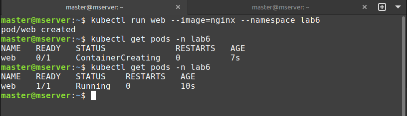
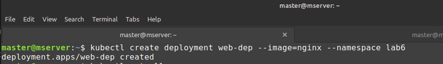
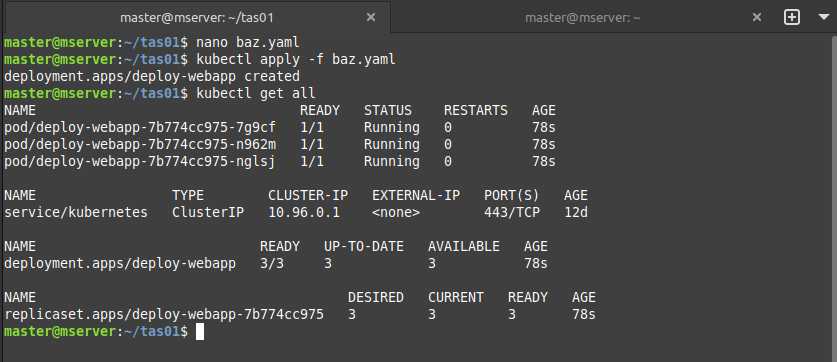

# Kubernetes Task 01

Here are some tasks for your learning & practice , You can complete and share working (Any 4)


**1- Create atleast 2 resources in the "lab6" ns and delete after completion.**

  Creating namespace `lab6`.
  ```bash
  kubectl create namespace lab6
  ```

  

  Creating Pod name web in `lab6`.
  ```bash
  kubectl run web --image=nginx --namespace lab6
  kubectl get pods -n lab6
  ```
  

  
  Creating deployment name web-dep in `lab6`.
  ```bash
  kubectl create deployment web-dep --image=nginx --namespace lab6
  ```
  

  ```bash 
  kubectl get all -n lab6
  ```

  


  Deleting all resources and namespace=lab6.

  ```bash 
  kubectl delete pod web -n lab6
  kubectl delete deployment web-dep -n lab6
  kubectl delete namespace lab6
  ```

  
  


**2- Create a deployment deploy-webapp using image `engineerbaz/htmlfile:5` having 3 replicas.**

  Creating required deployment in yaml.
  ```yaml
  apiVersion: apps/v1
  kind: Deployment
  metadata:
    name: deploy-webapp
    labels:
      app: web-dep
  spec:
    replicas: 3
    selector:
      matchLabels:
        app: simple-webapp
    template:
      metadata:
        labels:
          app: simple-webapp
      spec:
        containers:
          - name: baz-web
            image: engineerbaz/htmlfile:5
            ports:
              - containerPort: 80
  ```

  ```bash
  nano baz.yaml
  kubelctl apply -f baz.yaml
  kubectl get all
  ```
  
  

**3- Create a service using the following parameters : `Name: service-webapp; Type: NodePort; targetPort: 80; port: 80; nodePort: 30080; selector: simple-webapp` and Try to access the deployment using Node IP and port 30080.**

  Craeting Yaml with requirements.
  ```yaml
  apiVersion: v1
  kind: Service
  metadata:
    name: service-webapp
  spec:
    type: NodePort
    ports:
      - targetPort: 80
        port: 80
        nodePort: 30080
    selector:
      app: simple-webapp
  ```

  ```bash
  nano svc.yaml
  kubelctl apply -f svc.yaml
  kubectl get all
  ```
  


  Accessing web pod using node IP and port 30080.
 
  


**4- Create a new deployment called deploy-02 in the dev-ns namespace with 2 containers using images nginx & httpd images & expose them. It should have 2 replicas and they should be exposed so both webpages can be reachable.**

**5. Create a ConfigMap for storing your name & age**
