# Kubernetes Task 02

**1- Create atleast 2 resources in the "lab6" ns and delete after completion.**

  Creating namespace `lab6`.
  ```bash
  kubectl create namespace lab6
  ```

  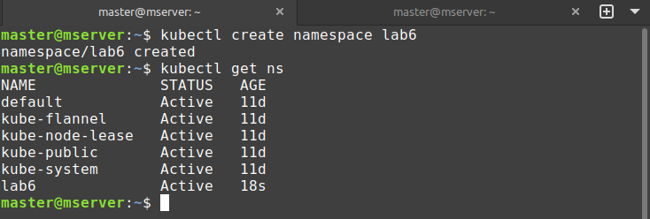

  Creating Pod name web in `lab6`.
  ```bash
  kubectl run web --image=nginx --namespace lab6
  kubectl get pods -n lab6
  ```
  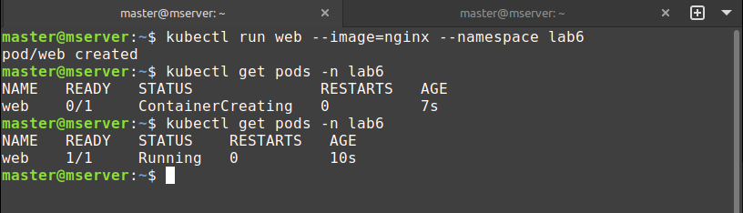

  
  Creating deployment name web-dep in `lab6`.
  ```bash
  kubectl create deployment web-dep --image=nginx --namespace lab6
  ```
  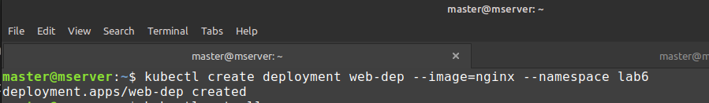

  ```bash 
  kubectl get all -n lab6
  ```

  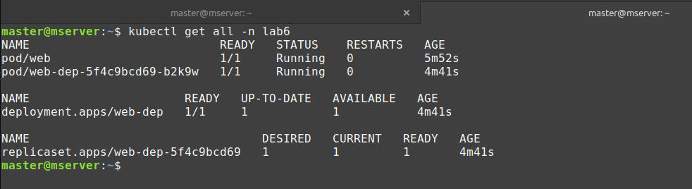


  Deleting all resources and namespace=lab6.

  ```bash 
  kubectl delete pod web -n lab6
  kubectl delete deployment web-dep -n lab6
  kubectl delete namespace lab6
  ```

  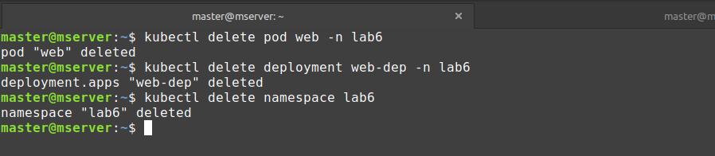
  


**2- Create a deployment deploy-webapp using image `engineerbaz/htmlfile:5` having 3 replicas.**

  Creating required deployment in yaml.
  ```yaml
  apiVersion: apps/v1
  kind: Deployment
  metadata:
    name: deploy-webapp
    labels:
      app: web-dep
  spec:
    replicas: 3
    selector:
      matchLabels:
        app: simple-webapp
    template:
      metadata:
        labels:
          app: simple-webapp
      spec:
        containers:
          - name: baz-web
            image: engineerbaz/htmlfile:5
            ports:
              - containerPort: 80
  ```

  ```bash
  nano baz.yaml
  kubelctl apply -f baz.yaml
  kubectl get all
  ```
  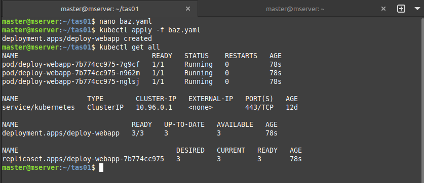
  

**3- Create a service using the following parameters : `Name: service-webapp; Type: NodePort; targetPort: 80; port: 80; nodePort: 30080; selector: simple-webapp` and Try to access the deployment using Node IP and port 30080.**

  Craeting Yaml with requirements.
  ```yaml
  apiVersion: v1
  kind: Service
  metadata:
    name: service-webapp
  spec:
    type: NodePort
    ports:
      - targetPort: 80
        port: 80
        nodePort: 30080
    selector:
      app: simple-webapp
  ```

  ```bash
  nano svc.yaml
  kubelctl apply -f svc.yaml
  kubectl get all
  ```
  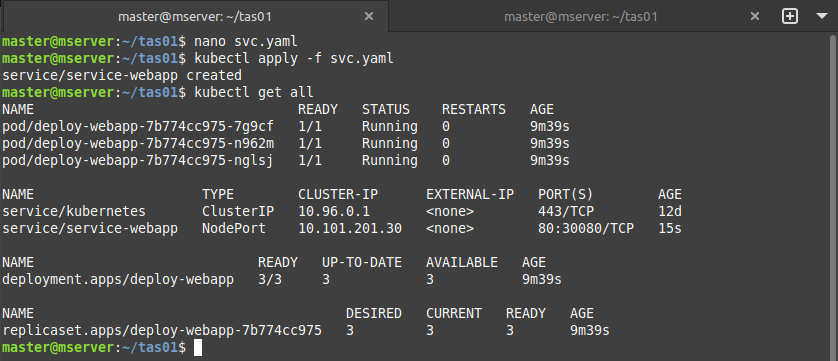


  Accessing web pod using node IP and port 30080.
 
  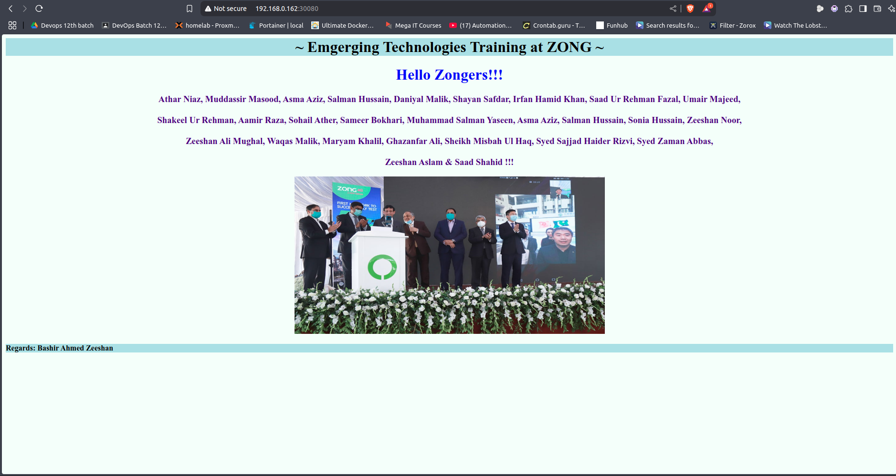


**4.Create a new deployment called deploy-02 in the dev-ns namespace with 2 containers using images nginx & httpd images & expose them. 
It should have 2 replicas and they should be exposed so both webpages can be reachable.**

  Craeting Yaml file name `deploy-02.yaml` for task with port `80` for httpd and port `8081` for nginx. To make sure nginx use port 8081 we need to created custom `nginx.conf` file and mount it on volume by using ConfigMap.

  ```yaml
  apiVersion: apps/v1
  kind: Deployment
  metadata:
    name: deploy-02
    namespace: dev-ns
    labels:
      app: 2web-dep
  spec:
    replicas: 2
    selector:
      matchLabels:
        app: 2-webapps
    template:
      metadata:
        labels:
          app: 2-webapps
      spec:
        containers:
          - name: nginx
            image: nginx
            ports:
              - containerPort: 8081
            volumeMounts:
              - name: nginx-config
                mountPath: /etc/nginx/nginx.conf
                subPath: nginx.conf
  
          - name: httpd
            image: httpd
            ports:
              - containerPort: 80
  
        volumes:
          - name: nginx-config
            configMap:
              name: nginx-config
  ```

  To Change `nginx` configuration to listen on port 8081 we need to create ConfigMap with `nginx.conf` file.

  Creating `nginx.conf`

  ```yaml
  worker_processes  1;
  
  events {
      worker_connections  1024;
  }
  
  http {
      include       mime.types;
      default_type  application/octet-stream;
  
      sendfile        on;
      keepalive_timeout  65;
  
      server {
          listen       8081;  # Change the port to 8081
          server_name  localhost;
  
          location / {
              root   /usr/share/nginx/html;
              index  index.html index.htm;
          }
  
          error_page   500 502 503 504  /50x.html;
          location = /50x.html {
              root   /usr/share/nginx/html;
          }
      }
  }
  ```

  ```bash
  nano nginx.conf
  kubectl create configmap nginx-config --from-file=nginx.conf -n dev-ns
  ```
  Creating deployment `deploy-02`.
  
  ```bash
  kubectl apply -f deploy-02.yaml -n dev-ns
  ```
  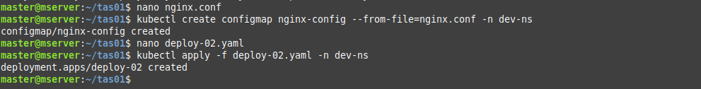

  Checking pods are created.

  ```bash
  kubectl get po -o wide -n dev-ns
  ```

  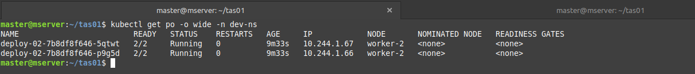


  Creating services with `NodePort` to expose pods containers.

  ```yaml
  apiVersion: v1
  kind: Service
  metadata:
    name: service-webapp2
    namespace: dev-ns 
  spec:
    type: NodePort
    ports:
      - name: httpd-port
        targetPort: 80
        port: 80
        nodePort: 30080     

      - name: nginx-port
        targetPort: 8081
        port: 8081
        nodePort: 30081

  selector:
      app: 2-webapps
  ```
  ```bash
  nano svc.yaml
  kubectl apply -f svc.yaml
  ```
  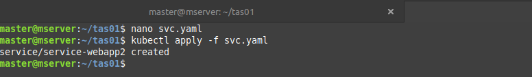

  ```bash
  kubectl get svc -n dev-ns
  ```
  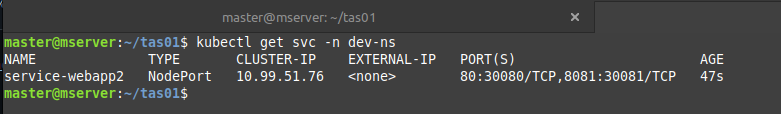

  Checking both container by accessing them with Node-IP (same for both) and Nodeport (30080 & 30081).

  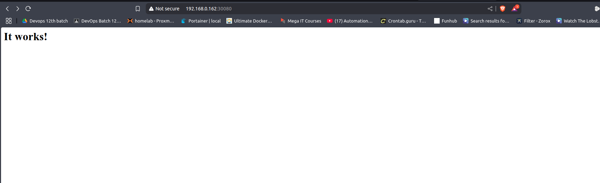


  
  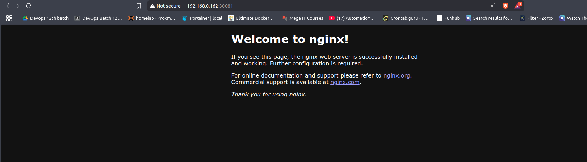


**5. Create a ConfigMap for storing your name & age**

  Creating yaml.

  ```yaml
  apiVersion: v1
  kind: ConfigMap
  metadata:
    name: tm-config
  data:
    name: "tariq-mehmood"
    age: "28"
  ```
  ```bash
  nano cm.yaml
  kubelctl apply -f cm.yaml
  kubectl get cm
  ```

  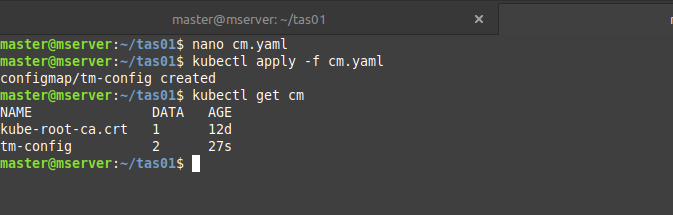
